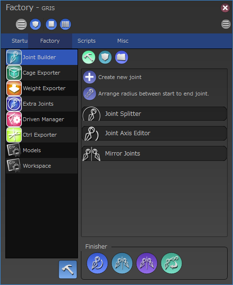

****************************************************
ScriptBasedRigging-概要
****************************************************

スクリプトベースによるリギングとは、リグ作成に必用な要素を予め用意しておき、
それらバラバラな要素をスクリプトによって組み立てていく（ビルド）手法です。

必用な要素はリギングする対象によって色々変わる場合もありますが、基本的に
以下のような要素が一般的です。

* モデル
* ボーン
* スキニングのウェイト
* ケージ
* ドリブンキー

などなど

このような要素を予め書き出しておき、その後ビルド用スクリプトを実行する
事によってリグを作成します。

ビルド用スクリプトにはファイルを読み込む順番や、ボーンにコントローラを追加する、
ウェイトを適用する、など様々な手順が書かれており、その手順に従ってリグを
組み立てていきます。

メリット・デメリット
================================

スクリプトベースのビルドには以下のようなメリットがあります。

* ボーンの位置調整などが簡単に行える。
* モデルに微調整があった場合の更新が容易。
* 規格が決まっているプロジェクトなどでは、複数のアセットへの移植が簡単にできる。
* 各要素はシンプルなデータが多いため、データのクリーンナップが容易。
* バリエーション違いが作りやすく、メンテナンスも容易。

逆に以下のようなデメリットもあります。

* 最初の作成に時間がかかるりやすい。
* 手作りのリグに比べてかなり高いスキルが要求される。
  特にスクリプトの知識が前提となるため、スクリプトを書けない場合は
  組織的なバックアップが必用になる。

grisは基本的にスクリプトベースによるリギングを前提にシステムが作られています。
以下の章ではgrisにおけるビルドシステムについて説明します。

コンストラクタとファクトリーモジュール
=================================================
スクリプトベースのビルドシステムでは上記のように

* 要素の書き出し
* スクリプトによるビルド

の２本を柱として構成されています。

grisではこの２つの柱をそれぞれ

* ファクトリーモジュール
* コンストラクタ

というシステムとして提供しています。

ファクトリーモジュールは要素の書き出しを行うためのインターフェースの
提供を行います。
コンストラクタはファクトリによって書き出された要素を組み立てるための
スクリプトを管理、実行するための仕組みを提供します。

ファクトリーウィンドウ
----------------------------------------------
これらコンストラクタとファクトリーモジュールを管理、運用するための専用GUI
**「ファクトリーウィンドウ」**
がgrisには用意されています。

ファクトリーウィンドウは、その名の通りファクトリーが提供する機能をユーザーに
インターフェースから操作させるためのGUIを提供します。

また、合わせてコンストラクタの実行や、これら一連のアセットに必用なプロジェクト
データの管理も行うためのインターフェースを提供します。

コンストラクタ(Constructor)
----------------------------------------------
概要
++++++++++++++
コンストラクタはスクリプトの実行順序やリギングをスクリプトで行うための補助する
メソッドを多数備えたシステムを内包したクラスです。

このクラスを実行すると、記述されている決まった手順に従ってスクリプトを
実行していきます。

grisには標準的な機能を持つコンストラクタ
**「StandardConstructor」**
がありますが、開発者はコンストラクタをカスタマイズする事によりプロジェクトの
運用に沿った手順を実行するカスタムコンストラクタを作ることもできます。

エクストラコンストラクタ(ExtraConstructor)
++++++++++++++++++++++++++++++++++++++++++++++++++
コンストラクタはカスタイズ可能ですが、プロジェクトごとに微妙に違う挙動の
コンストラクタを作成するのは非効率な場合があります。
また特定の種類のアセットだけ少し違う手順のフローに乗せたい時も、わざわざ
コンストラクタを別に用意するのは手間がかかってしまいます。

そんな場合はコンストラクタの一部の機能を拡張する事ができる
**「エクストラコンストラクタ」**
が有効な場合があります。

エクストラコンストラクタはメインとなるコンストラクタの実行するメソッドの
前後に任意の処理を差し込んだり、コンストラクタの持つメソッド自体を強制的に
上書きしたりなど、幅広いカスタマイズを行う事ができます。

またエクストラコンストラクタはアセットごとのコンストラクタ内で個別に
インストールする設計のため、アセットごとに任意の処理を入れる/入れないを
選択できるため、非常に汎用性が高くなっています。

ファクトリーモジュール(FactoryModule)
----------------------------------------------
概要
+++++++++
ファクトリーモジュールはコンストラクタがビルドする際に必用となる要素を
書き出すための仕組みを提供する事を目的としています。

コンストラクタは自身が必用とするファクトリモジュールを
指定できるようになっており、指定されたファクトリーモジュールは
ファクトリーウィンドウのカテゴリ欄に表示され、
GUIから任意の要素を書き出せるようになります。

代表的なファクトリーモジュール
+++++++++++++++++++++++++++++++++++++++
gris標準で内包されているファクトリーモジュールは以下のような物があります。

.. list-table:: gris標準ファクトリー一覧（例）
    :widths: 10 90

    *   - jointBuilder
        - ジョイントの作成補助、モジュラーリグの作成、保存を行う
    *   - cageExporter
        - ウェイトを入れるケージの保存を行う。
    *   - weightManager
        - ウェイトの書き出しを行う。
    *   - extraJointManager
        - 補助骨を作成、書き出しを行う。
    *   - drivenManager
        - ドリブンキーの編集、書き出しを行う。
    *   - controllerExporter
        - コントローラの編集、書き出しを行う。

.. _SBR-ProjectDirectory:

プロジェクトディレクトリ
=================================================================
grisのスクリプトベースのビルドには２つの柱がある事を紹介しました。
これらを運用するためにはそれぞれの要素を書き出すディレクトリや、
コンストラクタを記述したスクリプトを保存するためのディレクトリなど、アセットに
関連する一通りのデータを格納する場所が必用になります。

これらのデータをひとまとめにして保存するディレクトリを
**「プロジェクトディレクトリ」**
と呼びます。

        
ファクトリーセッティング(FactorySettings)
=================================================================
プロジェクトディレクトリ内にはコンストラクタ用のデータや、各種書き出すファイル
などが混在します。これらのデータを管理、運用するための仕組みが
**「ファクトリーセッティング」**
です。

ファクトリーセッティングはコンストラクタとファクトリーモジュールをつなぐための
システムであり、ファクトリーウィンドウはこのシステムを運用するためのGUI
となっています。

ファクトリーセッティングによって保持されている情報はプロジェクトディレクトリ
直下に
**「grisFactoryWorkspace.xml」**
というファイルに記述されます。

逆に言うならば、この
**grisFactoryWorkspace.xml**
が存在するディレクトリが、プロジェクトディレクトリという扱いになります。

FactorySettingsについての詳細は
:doc:`../dev/factorySettings`
をご覧下さい。