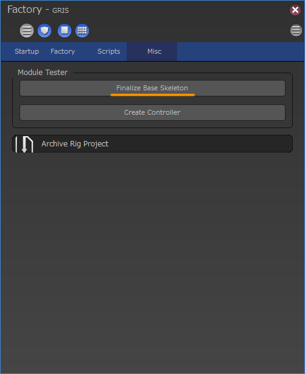

****************************************************
リグユニットの開発
****************************************************
grisはモジュラーリギングシステムを採用しています。
モジュラーリギングは目的に応じたリグをユニット単位で作成する事によって、
組み合わせによる汎用性を目指しています。

ここではリグユニットの仕様と新たに作成する方法について解説します。

仕様
=============================

.. _MRU-unit:

Unit
-----------
リグのモジュールはUnitと呼ばれるオブジェクトが全体管理を行います。
ユニットには以下のような情報が格納されています。

.. list-table::

    *   - ユニット名
        - ユニットの名前
    *   - 位置情報
        - このユニットが扱う位置情報(左、右など)
    *   - サフィックス
        - 同じユニットを復数使用する場合につける識別用サフィックス

また、ユニットにはリグを構築する上で必用な情報も保持しています。

* リグ作成に必用なジョイントの情報
* リグ作成時に必用なオプション情報

ユニットはこれらの情報を保持し、
必用に応じて後述するJointCreatorやRigCreatorに提供されます。

.. blockdiag::

    blockdiag{
        A[label='unit', shape=circle];
        B[label='JointCreator'];
        C[label='RigCreator'];

        A -> B,C [label='info'];
    }

重要なメソッド
++++++++++++++++++++++

.. list-table::

    *   - unitName()
        - ユニットの名前を返します。
    *   - position()
        - このユニットが扱う位置情報(左、右など)を返します。
    *   - suffix()
        - 識別用サフィックスを返します。
    *   - addMember(label=str, nodes=list)
        - ジョイントをユニットに紐付ける場合に使用します。
          紐付けられたジョイントは、
          後にgetMember(label)で取得する事が出来るようになります。
    *   - getMember(keyword=str)
        - addMemberで紐付けられたジョイントを取得します。

JointCreatorとRigCreator
-------------------------------
リグのモジュールを作成するにあたって、
girsではベースとなるジョイント作成を担うJointCreatorクラスと、
リグ作成を担うRigCreatorクラスの2つが重要な要素を担っています。

これらモジュールはgris本体が管理しており、
必用なタイミングでJointCreatorやRigCreatorが呼ばれるようになっています。

開発者は各クラスのprocessメソッドを上書きする事により、
目的のジョイントやリグを作成します。

Constructorクラス含め、
これらクラスは全てrigScript.BaseCreatorクラスのサブクラスとなっています。
そのため、Constructorと共通のメソッドを多数持っています。

.. blockdiag::

    blockdiag{
        A[label=BaseCreator];
        B[label=StandardCreator];
        C[label=JointCreator];
        D[label=RigCreator];
        E[label=BasicConstructor];
        
        group rigScripts{
            orientation = portrait;
            label='rigScripts';
            color='#2485D8';
            shape='line';
            fontsize=42;
            
            A -> B -> C,D;
        }
        
        A -> E;
        
        group {
            label='constructor';
            color='#ce4260';
            shape='line';
            fontsize=42;

            E;
        }
    }

共通の重要メソッド
++++++++++++++++++++++++++++++++++++++++
.. list-table::

    *   - **メソッド名**
        - **戻り値**
        - **説明**
    *   - unit()
        - grisNode.Unit:
        - このモジュールが管理するユニットノードを返します。
          ユニットノードにはリグを作成する際に使用するメタ情報を残すのに使用します。
          
          .. seealso::

            ユニットについては
            :ref:`MRU-unit`
            をご覧下さい。
    *   - addLockedList(nodelist=list)
        - None
        - 引数にはTransformノードの名前か、そのリストを渡します。
          このリストに登録されたノードはリグ作成完了時にtransformアトリビュートがロックされます。
    *   - removeLockedList(self, nodelist=list)
        - None
        - addLockedListに登録したノードの登録を解除したい場合はこのメソッドを使用します。

JointCreator
=============================
このクラスはジョイントの作成と、ファイナライズの管理を行うクラスです。
基本的なジョイントの作成は
**process**
メソッド内に記述し、ファイナライズの処理は
**finalize**
メソッド内に記述します。

JointCreatorが呼ばれるタイミング
------------------------------------
JointCreatorには前述の通り2つの機能があります。
この2つの機能はそれぞれ違うタイミングで呼ばれます。

.. _MRU-jcProcess:

process
+++++++++++++++++
これはユニットの作成時にに呼ばれ、
ユニットの情報を持つmetaノードと一緒にジョイントを作成する目的で使用されます。
簡易的に作成する場合は以下のコマンドで作成することで実行すうることができます。

.. code-block:: python

    from gris3 import core
    core.createJoint(unitType, baseName, position, suffix, parent, options)

引数は以下の通りです。

.. list-table::

    *   - **引数**
        - **型**
        - **説明**
    *   - unitType
        - str
        - 作成するユニットの名前を指定します。
    *   - baseName
        - str
        - 作成するユニットと、その関連オブジェクトにつける名前のベースとなる文字列を指定します。
    *   - position
        - str or int
        - 0～9の整数、またはL、Rなど位置を表す文字列を指定します。
    *   - suffix
        - str
        - ベースネームに追加するサフィックスを指定します。
        
          同じユニットが複数ある場合、このサフィックスを変えて指定して、名前の重複を防ぎます。
    *   - parent
        - str
        - ユニットの関連オブジェクトの親となるノード名を指定します。
    *   - options
        - dict
        - ユニット固有のオプションが指定できる場合、辞書型で指定することができます。

戻り値としてはJointCreatorオブジェクトが返されます。

finalize
+++++++++++
gris用finalize関数が呼ばれた際に一緒に呼ばれます。
finalize関数は以下の方法で呼ぶ事ができます。

.. code-block:: python

    from gris3 import core
    core.finalizeBaseSkeleton()

この関数は通常コンストラクタ内で呼ばれるため開発者は意識する必要はありませんが、
モジュール開発中にデバッグとして使用したい場合に便利です。

上記関数はGUIからもアクセスできます。
FactoryWidgetのMiscタブのFinalizeBaseSkeletonをクリックする事により実行可能です。

    
現在のgrisでは、
この機能はスクリプトベースのリギング内で使用する事が想定されているため不可逆機能であり、
戻るためにはUndoを使用する以外の方法はサポートしていません。
従って開発者は現在のところfinalize前の状態に戻るための関数を実装する必要はありません。

.. _MRU-unitAddMemberMethod:

UnitのaddMemberメソッド
++++++++++++++++++++++++++++++
JointCreatorによって作成されるジョイントなどのノードは、
後に呼ばれるRigCreatorクラスが必要に応じてアクセス出来るようになっている必要があります。

JointCreatorが作成したノードを、後々RigCreatorが呼べるようにするためには、
Unitに必要な情報を残しておく必要があります。

そこでJointCreator内で作成したノードのうちRigCreatorが必要となるノードは、
UnitオブジェクトのaddMemberメソッドを使用してUnitに登録しておきましょう。

addMemberの第1引数は、後でRigCreatorがノードにアクセスする際のキーワードとなります。

.. code-block:: python
    :linenos:

    name = self.basenameObject()    #ベースとなる名前オブジェクトを取得。
    parent = self.parent()          #親ノードを取得。
    unit = self.unit()              #Unitオブジェクトを取得。
    
    name.setName('sampleRoot')
    jnt = node.createNode('joint', n=name(), p=parent)
    # 作成したジョイントをrootJointとして登録。
    unit.addMember('rootJoint', jnt)
    
    # 登録したジョイントの取得。(基本的に使用するのはfinalize内かrigCreator内)
    root_jnt = unit.getMember('rootJoint')

JointCreator固有の重要メソッド
----------------------------------------

.. list-table::

    *   - **メソッド名**
        - **戻り値**
        - **説明**
    *   - basenameObject()
        - system.AbstractNameRule:
        - 予め設定された情報を元に作成された名前ルールオブジェクトを返します。
        
          作成するジョイントの名前をつける際にこのオブジェクトを使用すると、
          開発者はユニットがどの位置のものなのかや、
          オプションとして指定されたサフィックスを意識することなく名前付けを行う事ができます。
          
          基本的に名前をつける際にはこのオブジェクトを使用する事を推奨しています。
    *   - asRoot(*joints)
        - None
        - 引数に作成した任意のジョイントやトランスフォームノードを渡します。
          渡されたノードはルートノードとして設定され、
          ユニットのルートであることを示すロケータが追加されます。
          
          この機能は視認性以外には特に効果はありません。
    *   - parent()
        - node.Transform
        - このユニットの親となるノード名を返します。
          原則、ジョイントを作成する場合はこのノードの下階層に作成して下さい。

RigCreator
=============================
このクラスはJointCreatorによって作成されたジョイントに対し、
リグを追加する事を目的として設計されたクラスです。

このクラスのprocessメソッド内にコントローラ作成用のスクリプトを記述します。
processメソッドは必ずJointCreatorで任意のジョイントが作成され、
Finalizeを経た後に呼ばれる事が前提になっています。

JointCreatorが作成したノードを取得する
------------------------------------------------
コントローラやリグを作成する場合、
当然予め作成されたノードをベースに作成していきます。

この予め作成されたノードを取得するにはUnitオブジェクトの
**getMember**
メソッドを使用します。

getMemberの第1引数には、取得したいノードを登録した際に使用したキーワードを渡します。
キーワードはJointCreator内でaddMemberを使用した際に用いられた第1引数になります。

.. seealso::
    :ref:`MRU-unitAddMemberMethod`

RigCreator固有の重要メソッド
----------------------------------------

.. list-table::

    *   - **メソッド名**
        - **戻り値**
        - **説明**
    *   - axisX()
        - str:
        - ユニットのposition設定にもとづいて、X軸が正方向か負方向かを返します。
        
          ユニットのposition情報が「R」の場合-Xを、それ以外の場合は+Xを返します。
    *   - vectorX()
        - list
        - ユニットのposition設定にもとづいて、X軸が正方向か負方向かを返します。
        
          ユニットのposition情報が「R」の場合[-1, 0, 0]を、
          それ以外の場合は[1, 0, 0]を返します。
    *   - animSet()
        - grisNode.AnimSet
        - このユニットが使用するAnimSetを返します。
          モジュール内で作成したコントローラは必ずこのAnimSetに登録して下さい。

プリセット
====================
任意のリグユニットを組み合わせたものを、プリセットとして提供する事が出来ます。
プリセットはpyファイルによって定義されます。
プリセットのpyファイルはリグユニットと同じ階層に作成する事で機能するようになります。

プリセットファイルの仕様
------------------------------
クラスの定義
+++++++++++++++++++++++
プリセットファイルをプリセットと認識させるには、ファイル内に
**Preset**
クラスを定義します。

grisはクラス名でプリセットかどうかを判断しているため、必ずクラス名は
**Preset**
にして下さい。

**Preset**
クラスはgris3.rigScriptsモジュールのPresetクラスを継承させます。

.. code-block:: python
    :linenos:
    
    from gris3 import rigScripts, node

    class Preset(rigScripts.Preset):
        pass

メソッドをオーバーライドする
+++++++++++++++++++++++++++++++++++++++++++
Presetクラスを定義したら、次は任意のメソッドをオーバーライドします。
オーバーライドするメソッド名は以下をご参照下さい。

.. list-table::

    *   - **メソッド名**
        - **戻り値**
        - **説明**
    *   - name()
        - str:
        - ユーザーに提示するプリセット名を返します。
    *   - description()
        - str
        - ユーザーにプリセットの内容を説明するためのテキストを返します。
    *   - includes()
        - list
        - このプリセットが使用するユニット名をリストとして返します。
          リストにはrigScripts.PresetElementクラスのインスタンスを任意の数だけ
          入れておきます。

          詳細については
          :ref:`MRU-presetElement`
          をご確認下さい。
    *   - create(creators)
        - None
        - 引き数creatorsにはincludesで登録されているリグユニットが辞書形式で渡されます。
          デフォルトではincludesメソッドで登録されているリグユニットを
          すべて使用してbaseJointを作成します。
          挙動を変える場合はこのメソッドをオーバーライドします。
          詳細は
          :ref:`MRU-presetSampleCode`
          をご覧下さい。

.. _MRU-presetElement:

PresetElement
+++++++++++++++++++
プリセットで使用するリグユニットを登録する際に、このクラスを使用します。
まずは登録する場合のサンプルコードをご覧下さい。

.. code-block:: python
    :linenos:
    
    def includes(self):
        return [
            rigScripts.PresetElement('humanSpineRig', 1),
            rigScripts.PresetElement('humanClavicleRig', 2),
            rigScripts.PresetElement('humanArmRig', 2),
            rigScripts.PresetElement('humanClavicleRig', 3),
            rigScripts.PresetElement('humanArmRig', 3),
            rigScripts.PresetElement('humanHandRig', 3),
        ]

includesメソッドはリストを返す必要があります。
リスト内には
**rigScripts.PresetElement**
のインスタンスを任意のリグユニットの数だけ入れておきます。

PresetElementクラスはインスタンス生成時に引き数を渡す以外には特に操作する必要はありません。

.. list-table::

    *   - **引き数**
        - **型**
        - **説明**
    *   - unitName
        - str
        - 使用するユニット名を指定します。
    *   - position
        - int
        - 位置を表す整数です。
          使用できる整数の範囲は0～8です。
          代表的な数字は
          1：センター
          2：左
          3：右
          になります。
    *   - suffix
        - str
        - 同じユニットを複数使用する場合、識別用につけるサフィックスです。

.. _MRU-presetSampleCode:

プリセットのサンプル
++++++++++++++++++++++++++++++
.. literalinclude:: makingRigUnits/unitPreset.py
    :language: python
    :linenos:

サンプル
=============================
新規で作成する
------------------
リグのモジュールの雛形はコマンドで作成できるようになっています。
以下のコマンドを実行することにより、リグモジュールを作成する事ができます。
(ver.0.9.5.3から)

.. code-block:: python
    :linenos:

    from gris3 import scriptTemplates
    c = scriptTemplates.RigUnitCreator()
    c.setCategory('Sample')
    c.setFileName('sampleRig')
    c.create()

**setCategory**
メソッドは、リグユニット一覧の時にカテゴライズする名前を設定します。
同じカテゴリになるとGUI上では一つにまとめられます。
指定しなければどのカテゴリにも属さず、トップ階層にリストされます。

.. image:: ../img/makingRigUnits/001.png
    :height: 300

**setFileName**
メソッドは作成するリグの名前を指定します。
このメソッドは必ず指定する必要があり、
既存のリグスクリプトと重複している場合は作成が無視されます。

