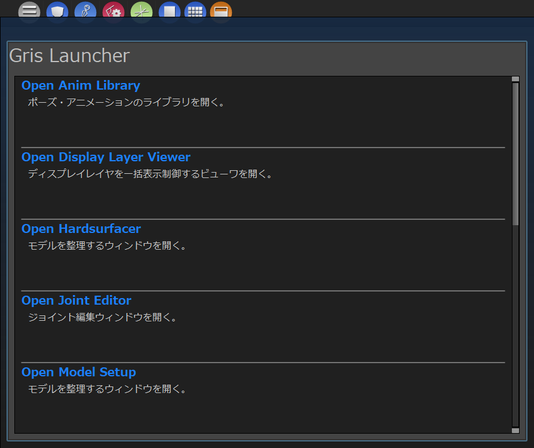
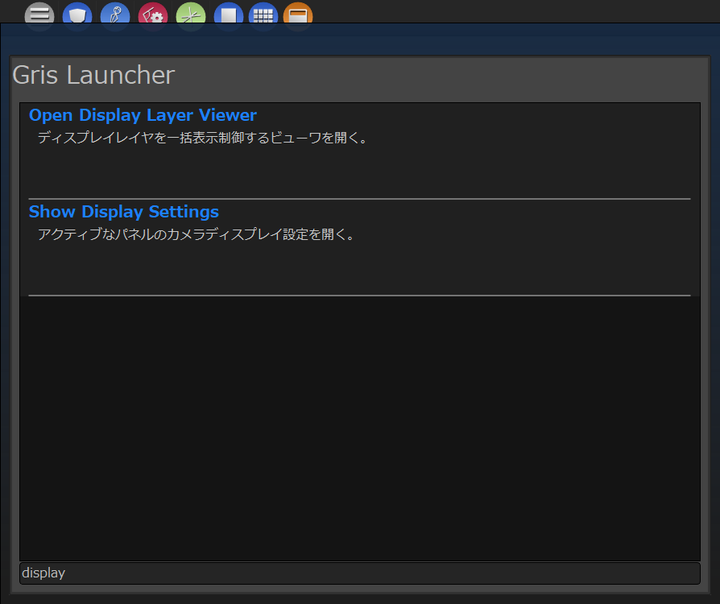

****************************************************
uilib.extendedUIモジュール
****************************************************
このモジュールは特殊な用途の拡張GUIを提供します。

.. _DEVUI-ETUI-FilteredView:

FilteredView
============================================
このクラスはQAbstractItemView系ウィジェットに表示フィルタ機能を追加したものを
提供します。

ビューウィジェットは
**createView**
関数を、モデルは
**createModel**
関数を用いて任意のものを作成します。  

作成されたビューにフォーカスされている時に、Tabキーを押すとフィルタ文字入力用の
ラインフィールドがビュー下部に表示されます。

このフィールドに文字を入力すると、ビューはフィルタされた結果を表示します。

メソッド
----------------------
以下に重要なメソッドを何点かリストアップします。

.. list-table::

    +   -   **メソッド名**
        -   **引数**
        -   **戻り値**
        -   **説明**
    +   -   createView
        -   
        -   QtWidgets.QAbstractItemView
        -   このウィジェットに使用するビューを作成して返します。
    +   -   createModel
        - 
        -   QtGui.QStandardItemModel
        -   このウィジェットで使用する任意のItemModelを作成して返します。
    +   -   filterKeyColumn
        -   
        -   int
        -   フィルタに使用するカラム番号を返します。デフォルトは0です。
    +   -   view
        -   
        -   QtWidgets.QAbstractItemView
        -   createViewで作成したビューにアクセスします。

使用例
----------------------

.. code-block:: python
    :linenos:

    from gris3.uilib import QtWidgets, QtGui, QtCore
    from gris3.uilib import extendedUI, mayaUIlib

    class SampleView(extendedUI.FilteredView):
        def __init__(self, parent=None):
            super(SampleView, self).__init__(parent)
            self.setWindowFlags(QtCore.Qt.Window)
            self.setWindowTitle('GRIS ExtendedUI - FileteredView')

        def createView(self):
            r"""
                ビューとして使用するQAbstractItemViewのサブクラスを作成して返す。
                
                Returns:
                    QtWidgets.QListView:
            """
            view = QtWidgets.QListView()
            view.setVerticalScrollMode(QtWidgets.QListView.ScrollPerPixel)
            view.setHorizontalScrollMode(QtWidgets.QListView.ScrollPerPixel)
            return view
        
        def createModel(self):
            r"""
                任意のItemModelを作成して返す。今回はQStringListModel。
                
                Returns:
                    QtCore.QStringListModel:
            """
            return QtCore.QStringListModel()

        def setItems(self, itemlist : list):
            r"""
                ビューにアイテムを追加する。
                
                Args:
                    itemlist(list):文字列のリスト
            """
            model = self.view().model().sourceModel()
            model.setStringList(itemlist)

    view = SampleView(mayaUIlib.MainWindow)
    view.resize(480, 600)
    view.setItems(['hoge', 'age', 'sage', 'alpha', 'beta'])
    view.show()

