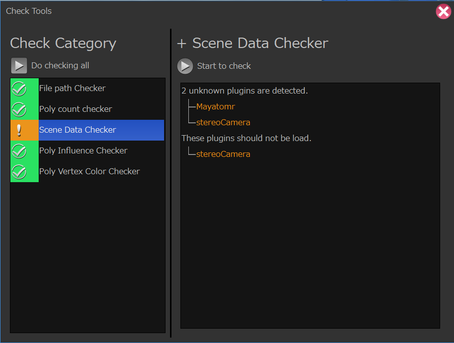
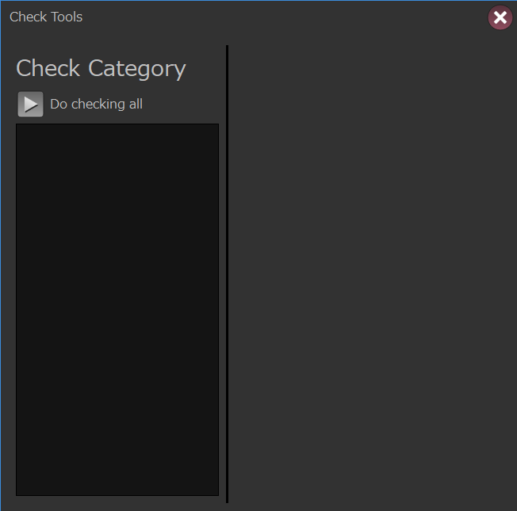
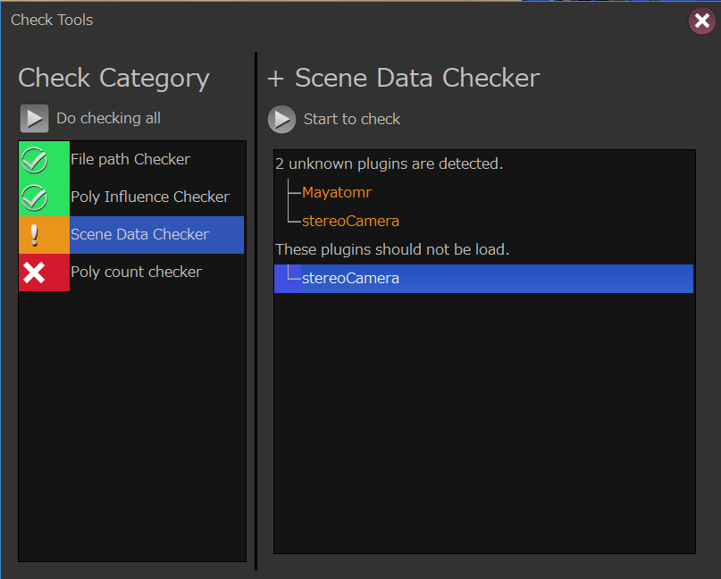
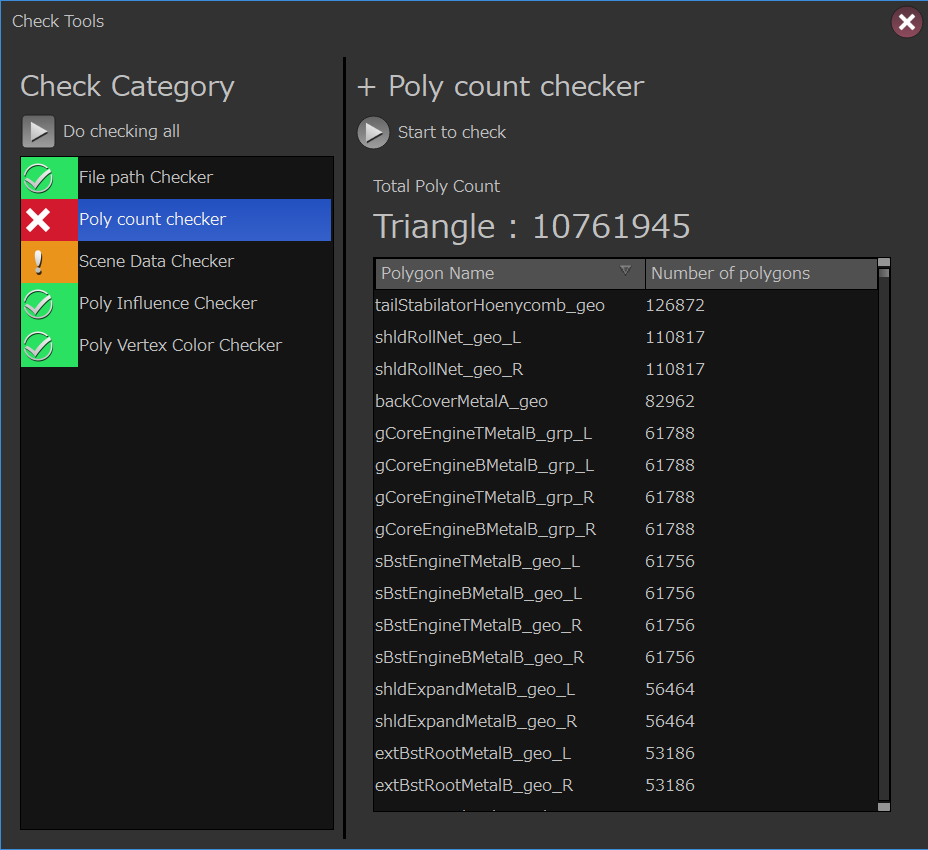
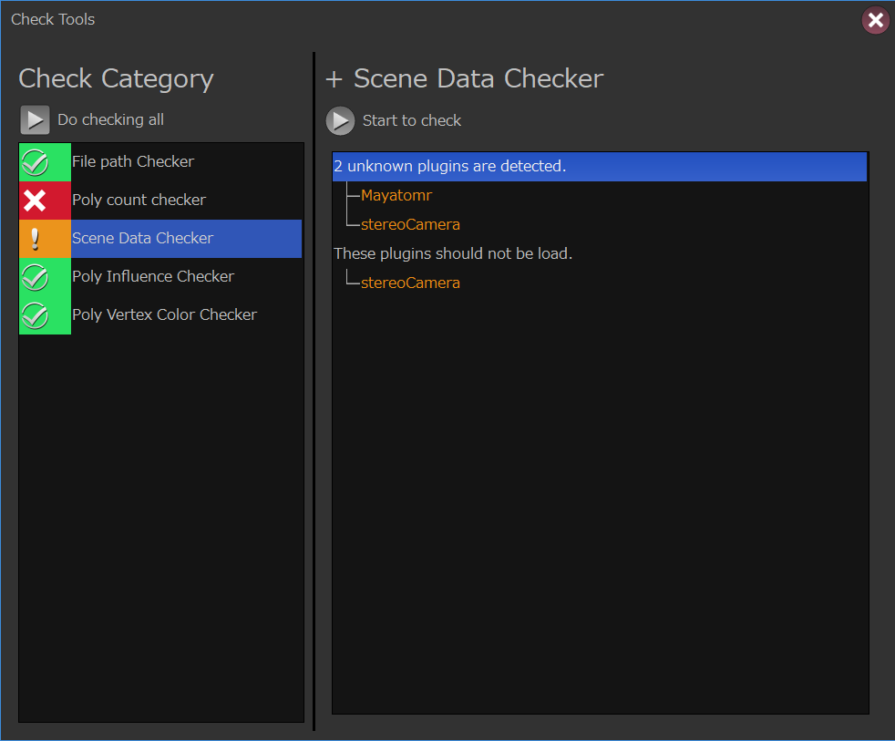
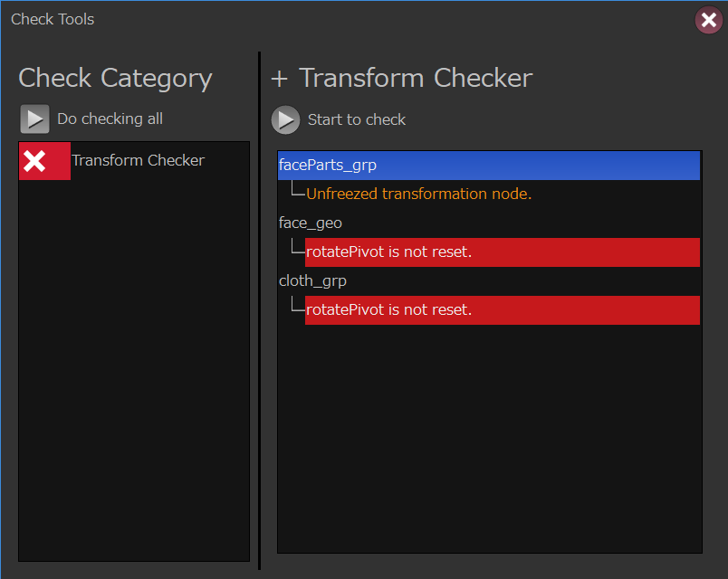

Check Tools
****************************************************
このガジェットはアセットをチェックするためのチェック機能を提供します。

カテゴリを追加する。
======================
CheckToolsはデフォルトでは何もチェックする項目がありません。

CheckToolsを使用するには専用のフォーマットで作成されたカテゴリ定義ファイル
（またはPythonの辞書オブジェクト）が必要になります。

この章ではカテゴリ定義ファイル（またはデータ）を作成する方法を紹介します。

Pythonモジュールを使用してテンプレートから作成する。
-------------------------------------------------------
checkToolsにはテンプレートから任意のカテゴリ定義データを作成するための
ヘルパークラスが用意されています。

このクラスを用いてカテゴリの定義を行いっていきます。

カテゴリ作成を行うには

    **gris3.gadgets.checkTools.util**

モジュールにある
**CategoryOptionTemplateCreator**
クラスを使用します。

.. code-block:: python
    :linenos:

    from gris3.gadgets.checkTools import util
    cat_opt = util.CategoryOptionTemplateCreator()

カテゴリを追加する。
-----------------------------------
それではカテゴリを追加してみましょう。
カテゴリを追加するには
**addCategory**
メソッドを使用します。

.. list-table::

    +   -   **メソッド名**
        -   **引数**
        -   **戻り値**
        -   **説明**
    +   -   addCategory
        -   categoryName : str

            modulePrefix : str
            
            options : dict
        -   
        -   カテゴリをテンプレートに追加します。

categoryName
+++++++++++++++++++++
追加したいカテゴリ名を文字列で指定します。

.. hint::
    GRISを標準で付属しているカテゴリモジュールを知るには
    :ref:`GGTCT-ListCategories`
    をご覧下さい。

modulePrefix
+++++++++++++++++++++
カテゴリモジュールが標準ではない場合のモジュールプレフィックスを指定します。

例えばカテゴリモジュールが外部モジュールaddonModulesのcheckToolsの中に
格納されているsampleExtCheckerだった場合、modulePrefixは

**addonModules.checkTools**

になります。

options
+++++++++++++++++++++
カテゴリモジュールに渡すオプションになります。
オプションはカテゴリモジュール毎に設定されているので、各モジュールの説明を
確認して下さい。

使用例
+++++++++++++++++++++

.. code-block:: python
    :linenos:

    from gris3.gadgets.checkTools import util
    cat_opt = util.CategoryOptionTemplateCreator()
    cat_opt.addCategory('filePathChecker')
    cat_opt.addCategory('skinInfluenceChecker')
    # sceneDataCheckerには不要と判断するプラグイン名のリストをオプションで指定する必要がある。
    cat_opt.addCategory(
        'sceneDataChecker',
        options={'invalidPlugins': ['mtoa', 'stereoCamera', 'Turtle']}
    )

カテゴリ定義情報を書き出す
-----------------------------------
addCategoryで追加した情報を元にカテゴリ定義情報を出力するには
**getCategoryOption**
メソッドを使用します。

.. code-block:: python
    :linenos:

    from gris3.gadgets.checkTools import util
    cat_opt = util.CategoryOptionTemplateCreator()
    cat_opt.addCategory('filePathChecker')
    cat_opt.addCategory('skinInfluenceChecker')
    # sceneDataCheckerには不要と判断するプラグイン名のリストをオプションで指定する必要がある。
    cat_opt.addCategory(
        'sceneDataChecker',
        invalidPlugins=['mtoa', 'stereoCamera', 'Turtle']
    )
    # json形式（テキスト）形式で出力。
    textdata = cat_opt.getCategoryOption()

出力されたデータ（Json形式のテキスト）

.. code-block:: json
    :linenos:

    {
        "version": "1.0.0",
        "dataType": "grisCheckToolPreset",
        "defaultModulePrefix": "-default",
        "categoryList": [
            {
                "moduleName": "filePathChecker",
                "options": {}
            },
            {
                "moduleName": "skinInfluenceChecker",
                "options": {}
            },
            {
                "moduleName": "sceneDataChecker",
                "options": {
                    "invalidPlugins": [
                        "mtoa",
                        "stereoCamera",
                        "Turtle"
                    ]
                }
            }
        ]
    }

このメソッドを使用するとデフォルトではcheckToolsが読み込めるjson形式のテキストを
出力します。

この出力結果をjsonファイルとして任意の箇所へ保存し、
そのファイルをcheckToolsに読み込ませることにより、
定義されたカテゴリを表示するようになります。

カテゴリファイルのjsonの保存には
**saveAsCategoryFile**
メソッドを使用することで簡単に行うことができます。

このメソッドを使用する場合、書き出し先のディレクトリはすでに作成しておく必要が
ある点にご注意下さい。
また、既存のファイルがある場合は強制的に上書きされる点もご注意下さい。

戻り値は書き込みを行ったjsonファイルのフルパスになります。
また、引数でjsonの拡張子をつけていなかった場合は自動で付与され、戻り値に反映されます。

.. code-block:: python
    :linenos:

    import os
    from gris3.gadgets.checkTools import util

    cat_opt = util.CategoryOptionTemplateCreator()
    cat_opt.addCategory('filePathChecker')
    cat_opt.addCategory('skinInfluenceChecker')
    # sceneDataCheckerには不要と判断するプラグイン名のリストをオプションで指定する必要がある。
    cat_opt.addCategory(
        'sceneDataChecker',
        invalidPlugins=['mtoa', 'stereoCamera', 'Turtle']
    )
    # polyCountCheckerはカウント対象グループ名と上限値を設定する。
    cat_opt.addCategory(
        'polyCountChecker',
        target=['geo_grp'], goalCount=80000, limitCount=100000
    )
    # テンポラリに書き出し（Windowsの場合）
    json_path = cat_opt.saveAsCategoryFile(os.path.expandvars(r'%TEMP%\testCheckToolTemplate.json'))

    # 設定した内容に従ってcheckToolsを起動する。
    from gris3.gadgets import checkTools
    checkTools.showWindow(json_path)

上記のサンプルコードでは一時ファイルを作成して、それをcheckToolsに読み込ませて起動しています。

↑試しに処理を実行してみた結果。

カテゴリ定義情報を書き出さずに起動する。
-------------------------------------------------
カテゴリ定義情報は書き出さなくとも、CategoryOptionTemplateCreatorで作成した情報を
そのままcheckToolsに渡すことで起動することができます。

.. code-block:: python
    :linenos:
    
    from gris3.gadgets.checkTools import util
    cat_opt = util.CategoryOptionTemplateCreator()
    cat_opt.addCategory('filePathChecker')
    cat_opt.addCategory('skinInfluenceChecker')
    cat_opt.addCategory(
        'sceneDataChecker',
        invalidPlugins=['mtoa', 'stereoCamera', 'Turtle']
    )
    # 辞書形式のデータとして生のまま書き出し
    data = cat_opt.getCategoryOption(toJson=False)

    from gris3.gadgets import checkTools
    # 辞書データをそのまま渡す。
    checkTools.showWindow(data)

デバッグ時や中間ファイルを生成せずに配布したい場合などはこちらの起動コマンドを
渡すと良いでしょう。

.. _GGTCT-ListCategories:

標準で付属しているカテゴリを一覧する
==================================================================
GRISを標準で付属しているカテゴリモジュールを知るには
**gris3.gadgets.checkTools.util**
モジュールの
**listCategories**
関数を使用します。

.. code-block:: python
    :linenos:

    from gris3.gadgets.checkTools import util
    util.listCategories()
    # Result: ['filePathChecker', 'polyCountChecker', 'sceneDataChecker', 'skinInfluenceChecker', 'vtxColorChecker']

標準以外のカテゴリモジュールを一覧で取得するには第1引数
**modulePrefix**
に、カテゴリモジュールを内包するパッケージ名を記述します。

.. code-block:: python
    :linenos:

    from gris3.gadgets.checkTools import util
    # addons.checkToolModules内にカテゴリモジュールがある場合
    categories = util.listCategories(addons.checkToolModules)

.. _GGTCT-DefaultCategories:

標準で付属しているカテゴリ
==================================================================

filePathChecker
---------------------------
任意のノードが参照しているファイルが存在するかどうかのチェックを行います。

現状のバージョンではfileノードのUDIM設定などは対応していません。

**オプション**

.. list-table::

    +   -   **オプション名**
        -   **型**
        -   **デフォルト値**
        -   **説明**
    +   -   types
        -   list
        -   [('file', 'ftn')]
        -   (操作対象ノードのタイプ（str）、取得するアトリビュート名（str))
        
            の2つの情報を持つタプル（またはリスト）をリスト化したものを渡します。

polyCountChecker
---------------------------
任意のグループ内に格納されているポリゴンのカウントを行い、
目標数に対して多い場合エラーとして表示されます。

**オプション**

.. list-table::

    +   -   **オプション名**
        -   **型**
        -   **デフォルト値**
        -   **説明**
    +   -   target
        -   list
        -   ['all_grp']
        -   ポリゴン数をカウントする操作対象グループ名のリスト
    +   -   goalCount
        -   int
        -   None
        -   目標とするポリゴン数。
        
            この数を超えるとチェックツールでは警告として表示されます。
    +   -   limitCount
        -   int
        -   None
        -   上限値とするポリゴン数。
        
            この数を超えるとチェックツールではエラーとして表示されます。
        

sceneDataChecker
---------------------------
unknownプラグインの検知と、任意のプラグインが読み込まれているかどうかをチェックします。

任意のプラグインの読み込みチェックについては、
主に読み込む必要がないプラグインをリストアップする目的で使用します。

**オプション**

.. list-table::

    +   -   **オプション名**
        -   **型**
        -   **デフォルト値**
        -   **説明**
    +   -   invalidPlugins
        -   list
        -   []
        -   シーン中で読み込んでおいて欲しくないプラグイン名（文字列)リストします。

skinInfluenceChecker
---------------------------
スキニングされたポリゴンの各頂点のインフルエンス数が既定値を超えて
いないかをチェックします。

**オプション**

.. list-table::

    +   -   **オプション名**
        -   **型**
        -   **デフォルト値**
        -   **説明**
    +   -   target
        -   list
        -   ['geo_grp']
        -   チェックする対象となる、スキニングされたポリゴンを格納した
            グループ名（文字列）のリストを指定します。
    +   -   numberOfLimit
        -   int
        -   4
        -   インフルエンス数の上限値を設定します。

vtxColorChecker
---------------------------
ポリゴンの頂点カラーセットが入っているかどうかのチェックを行います。

**オプション**

.. list-table::

    +   -   **オプション名**
        -   **型**
        -   **デフォルト値**
        -   **説明**
    +   -   target
        -   list
        -   ['all_grp']
        -   チェックする対象となるポリゴンを格納したグループ名（文字列）のリ
            ストを指定します。
    +   -   errorLevel
        -   int
        -   0
        -   警告止まりの場合１，エラーとして認識する場合は０を設定します。

transformChecker
---------------------------
Transformノードがフリーズされているかどうかをチェックします。

チェック項目は以下の2点です。

    - 行列的に単位行列になっているかどうか（フリーズされているかどうか）
    - 各種ピボットが０になっているかどうか

**オプション**

.. list-table::

    +   -   **オプション名**
        -   **型**
        -   **デフォルト値**
        -   **説明**
    +   -   target
        -   list
        -   ['all_grp']
        -   チェックする対象となるTransformを格納したグループ名（文字列）の
            リストを指定します。
    +   -   matrixErrorLevel
        -   int
        -   0
        -   フリーズされているかどうかのチェックに対する警告レベルを設定します。
            
            警告止まりの場合１，エラーとして認識する場合は０を設定します。
    +   -   pivotErrorLevel
        -   int
        -   0
        -   各種ピボットが０になっているかのチェックに対する警告レベルを設定します。
            
            警告止まりの場合１，エラーとして認識する場合は０を設定します。

