****************************************************
Joint Editor
****************************************************
このガジェットはジョイントを作成、編集するための便利機能を提供します。

Create new joint
===================
ジョイントの作成するための便利機能です。

.. image:: ../img/jointEditor/001.png
    :width: 300

    
作成する
--------------------
ボタンをクリックするとジョイントが作成されます。
何も選択していない場合は原点にジョイントが1つ作成されます。

.. image:: ../img/jointEditor/create001.png
    :width: 300

何かを選択した状態で作成する。
-----------------------------------
選択状態に応じて結果が変わります。

Transformノードが選択されている場合
++++++++++++++++++++++++++++++++++++++++++++++
Transformノードが選択されている場合、各ノードの直下にジョイントが作成されます。

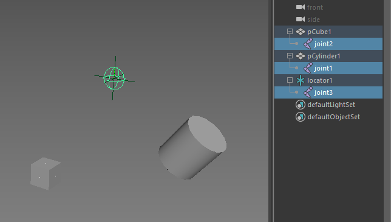

コンポーネントが選択されている場合
++++++++++++++++++++++++++++++++++++++++++++++
頂点が選択されている場合、各頂点上にジョイントが作成されます。

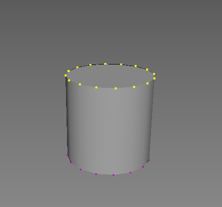
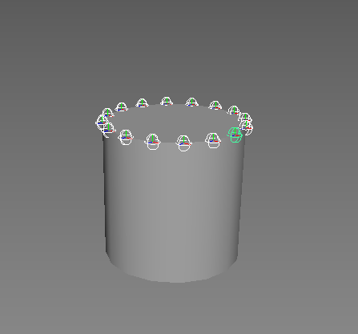

エッジやフェースの場合は、各コンポーネントの中点にジョイントが作成されます。

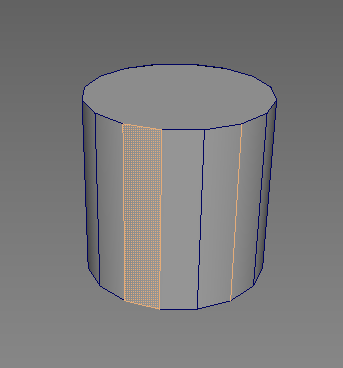
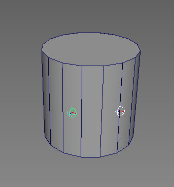

Ctrlを押しながらボタンをクリックする
++++++++++++++++++++++++++++++++++++++++++++++
選択している状態で、Ctrlを押しながらボタンをクリックすると、
選択コンポーネントやTransformの中心にジョイントが一つ作成されます。

.. image:: ../img/jointEditor/create007.png
    :width: 300
.. image:: ../img/jointEditor/create008.png
    :width: 300

Arrange radius between start to end joint
=========================================================
ジョイントチェーンのサイズを調整するための機能です。

.. image:: ../img/jointEditor/002.png
    :width: 300

    
ジョイントを2つ選択してからボタンをクリックします。

最初に選択したジョイントと最後に選択したジョイントの間のジョイントチェーンの大きさを変更します。
最初に選択したジョイントの大きさから最後に選択したジョイントの多きさ滑らかになるように、
間の各ジョイントチェーンの大きさを変更します。

最後に選択したジョイントは最初に選択したジョイントの子である必要があります。

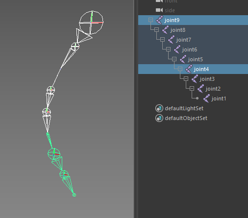
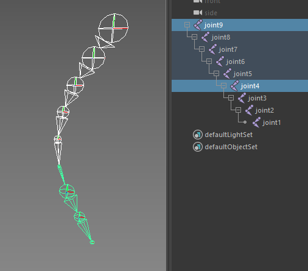

複数のジョイントチェーンを選択してCtrlを押しながらクリックすると、
各ジョイントから末端のジョイントにかけてジョイントチェーンの大きさをまとめて変更します。

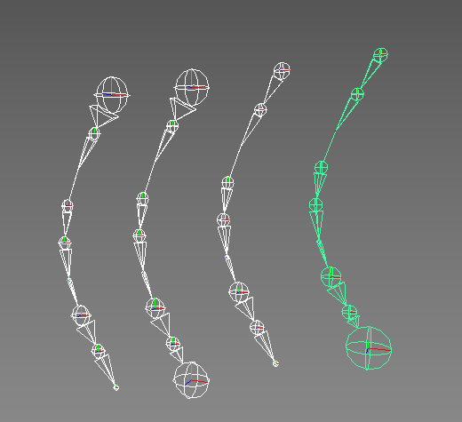
.. image:: ../img/jointEditor/arrange004.png
    :width: 300

Parent Tools
===================
ジョイントチェーンを作成する上で便利な機能を提供するツール群です。

.. image:: ../img/jointEditor/003.png
    :width: 300

Parent chain
----------------------------
選択した順番にジョイントを親子付けします。

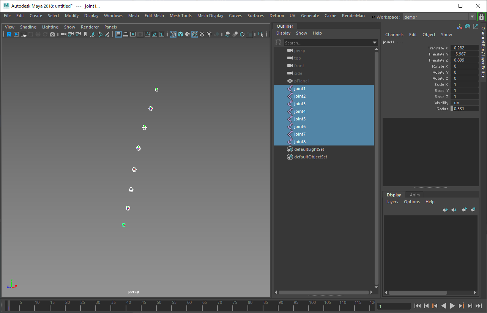
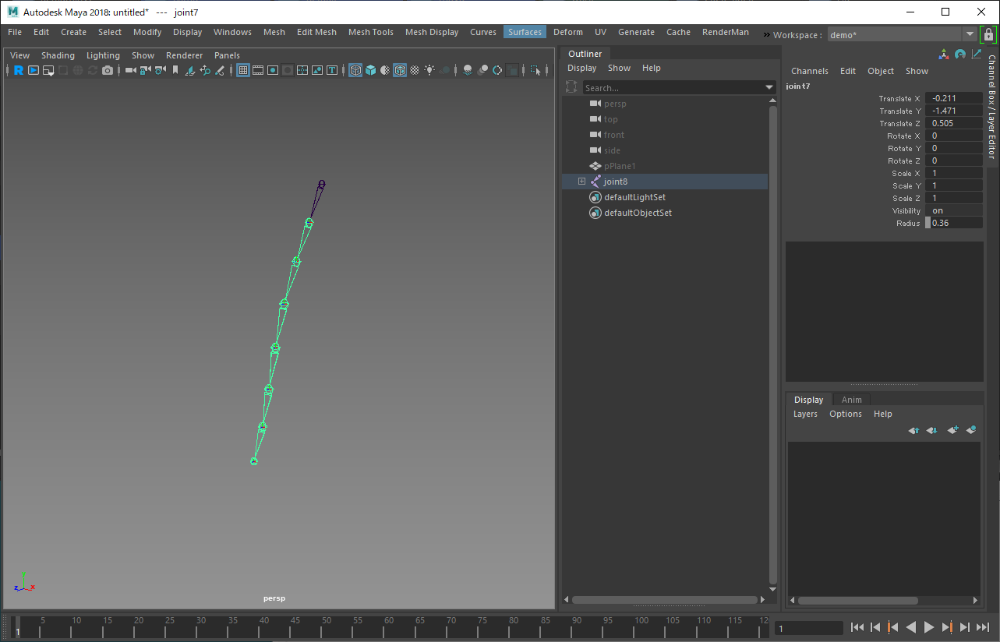

紫ボタンの方は選択とは逆順にジョイントを親子付けします。

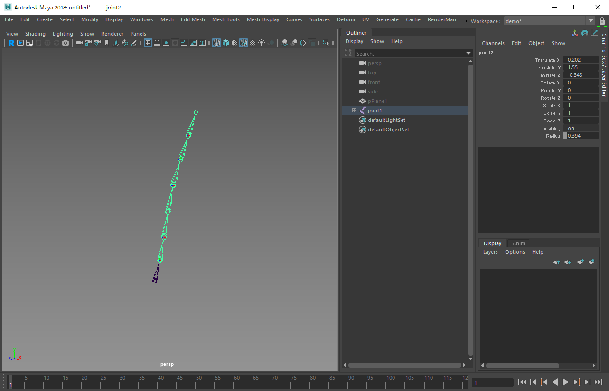

Camera based parent tool
----------------------------
このツールは複数のジョイントを任意の流れに沿ってペアレントし、
ジョイントチェーンを作成する機能です。

予めペアレント化したいジョイントを選択してから、
このボタンをクリックしてツールを起動します。

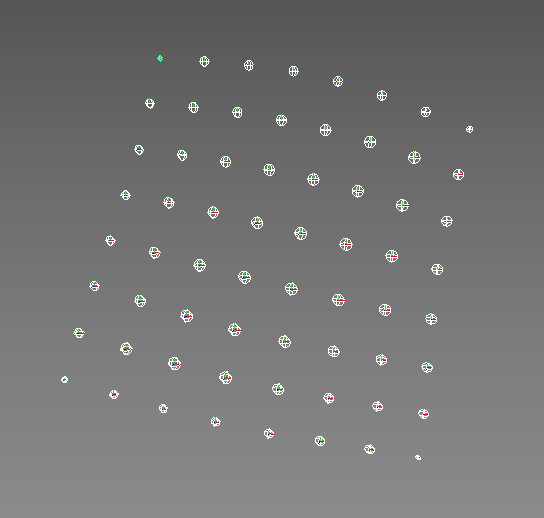

ツールを起動すると画面が少しだけ暗くなるので、
作成したいジョイントチェーンの方向にドラッグします。
    
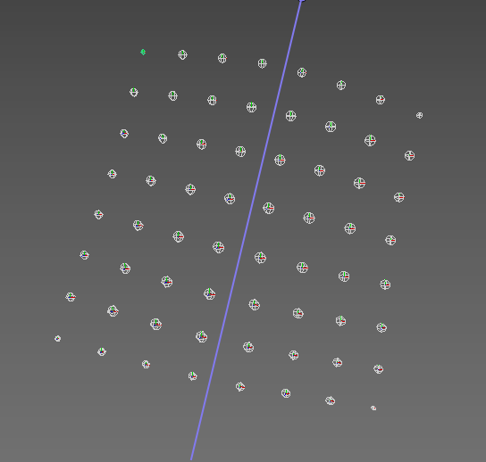

成功すると、ドラッグした方向にジョイントがペアレントされてチェーンが生成されます。

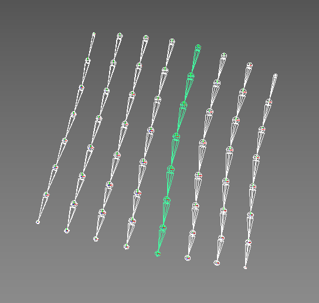

.. note::
    この機能を正しく機能させるためには、
    できるだけジョイントは規則正しく並んでいる方が望ましいです。
    
    また、ジョイントの末端の位置が不揃いだと、
    最良の結果を得られない可能性が高くなります。
    
    

Joint Splitter
===================
既存のジョイントを分割するための機能を提供するツール群です。

このツールを使用する場合、分割したいジョイントの子を選択してから使用します。

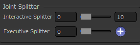

Interactive Splitter
---------------------------
操作方法
++++++++++++
まずは分割したいジョイントの子を選択します。

.. image:: ../img/jointEditor/splitter001.png
    :width: 300

続いてIntaractive Splitterのスライダをドラッグすると、
リアルタイムでジョイントが分割されます。

.. image:: ../img/jointEditor/splitter002.png
    :width: 300

好みの分割数になったらスライダを離して完了です。

.. image:: ../img/jointEditor/splitter003.png
    :width: 300

オプション
++++++++++++++++
スライダ左のフィールドには分割数の最小値、右には最大値を入れます。

スライダをドラッグする際、操作がシビアすぎる場合に調整して下さい。

Executive Splitter
---------------------------
Interactive Splitterとは逆に、設定に基づいた数にジョイントを分割します。
何度も同じ数だけ分割する場合に便利です。

分割を実行するには分割したいジョイントの子を選択し、
スライダ右の＋ボタンをクリックします。

Joint Axis Editor
===================
ジョイントの軸の向きを調整する機能を提供するツールです。
Maya標準のOrient Joint機能を拡張したような機能になっています。

この機能は選択したジョイントの軸の向きを調整するための機能です。

.. image:: ../img/jointEditor/005.png
    :width: 300

Apply to Children
-------------------------
このチェックがOnの場合、選択ジョイントの子階層にも適用します。

Freeze
-----------------
軸調整後、フリーズをかけます。
このためApplyToChildrenがOffでも子階層のRotate値は0になります。

Primary Axis
---------------------------
このセクションでは選択したジョイントを最優先でどの方向に向けるかを設定します。

基本的な動きとしてはTargetで指定した方向に、Axisで設定した軸を向けます。

Axis
++++++++
どの軸をターゲットの方向へ向けるかを設定します。

Target
+++++++++++++
Axisの向ける対象を設定します。

.. list-table::

    *   - First Child
        - 操作対象ジョイントの子のうち、Outliner上で一番上にあるノードを対象にします。
    *   - Origin
        - このオプションで指定した、操作前の軸にAxisを対象にします。
    *   - Vector
        - このオプションで指定したワールド空間での軸に対象にします。
    *   - Node
        - このフィールドに設定したTransformノードを対象にします。
        
Secondary Axis
---------------------------
このセクションでは選択したジョイントをPrimaryの方に向けつつ、
もう一つの軸をどの方向に向けるかを設定します。

基本的な動きとしてはTargetで指定した方向に、Axisで設定した軸を向けます。

Axis
++++++++
どの軸をターゲットの方向へ向けるかを設定します。
Primary Axisは必ずそのターゲットの方に向くのに対し、
こちらの軸はその姿勢を維持しながらできるだけ指定されたターゲットの方に向けます。

Target
+++++++++++++
Axisの向ける対象を設定します。

.. list-table::

    *   - Origin
        - このオプションで指定した、操作前の軸にAxisを対象にします。
    *   - Vector
        - このオプションで指定したワールド空間での軸に対象にします。
    *   - Node
        - このフィールドに設定したTransformノードを対象にします。
    *   - Surface
        - このフィールドにポリゴンかNurbsの法線方向を対象にします。

NodeのTips
+++++++++++++++++++++++++++++++++++++++++++++++
TargetをNodeにしている場合、
フィールドに登録されているTransformノードの方に軸を向けます。

このノードはTransformであれば何でもいいので、
perspカメラを登録すればカメラの方向に軸を向ける事ができます。

指や服の揺れものなど、軸の向きを複雑に調整しなくてはいけない場合に便利です。

.. image:: ../img/jointEditor/editAxis001.png
    :width: 300

↓

.. image:: ../img/jointEditor/editAxis002.png
    :width: 300

また、Nodeには複数のTransformノードを指定する事ができます。
その場合、操作対象ジョイントから最も近いTransformノードをSecandary Axisのターゲットとして使用します。

Mirror Joints
===================
ジョイントをミラーリングします。

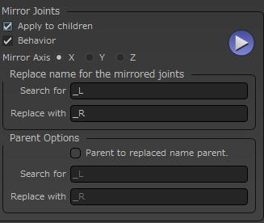
    
この機能はMaya標準のMirror Jointとほぼ同等の機能を持っていますが、
このツールでは標準機能と違い複数のジョイントを選択して、
まとめてミラーリングする事ができます。

Apply to chilren
-----------------------
この設定がOnの場合、子ジョイントもまとめてミラーリングします。

Behavior
-----------
Behaviorでミラーリングします。

Mirror Axis
-----------------
ミラーリングする軸を指定します。

Replace name for the mirrored joints
--------------------------------------------
元のジョイントの名前から"Search for"の文字列を検索し、
ミラーされたジョイントには"Replace with"の文字列に置き換えてリネームします。

Parent Options
------------------------
ミラーリングされたジョイントの親を指定する事ができます。
Parent to replaced name parentがOnの状態にすると、
ミラーリング元のジョイントの親ノードの名前から"Search for"の文字列を検索し、
"Replace with"で置き換えたノードの子にミラーリングされたジョイントを配置します。

置き換えた名前のノードがない場合はこの処理をスキップします。

Finisher
===================
ジョイントの仕上げ作業に使用する機能をまとめたツール群です。

.. image:: ../img/jointEditor/007.png
    :width: 300

Fix orientation
-------------------------

選択したジョイントと、その一番したの階層までのジョイントに対して軸補正を行います。

軸補正とは

- 子階層に向けてX軸（または-X軸）を向ける
- それ意外の軸は極力維持

を行ないます。

Mirror to opposite side
-------------------------
.. image:: ../img/jointEditor/finisher002.png

選択したジョイントの反対側のジョイントに対してミラーリングを適用します。
反対側とは命名規則に則ったジョイント名である事を前提に、
位置を表す文字列がLの場合R、Rの場合Lに対して適用します。

既存のジョイントに対してミラーリングをかけたい場合に便利です。

Mirror from firset selection to second selection
------------------------------------------------------
.. image:: ../img/jointEditor/finisher003.png

"Mirro to opposite side"は自動的に反対側のジョイントを探してきますが、
こちらはn番目のジョイントの位置をn+1番目ののジョイントにミラーリングして適用します。

Connect inverse scale
-------------------------

選択したジョイントの親ノードのscaleを、選択ジョイントのinverseSacleに接続します。
